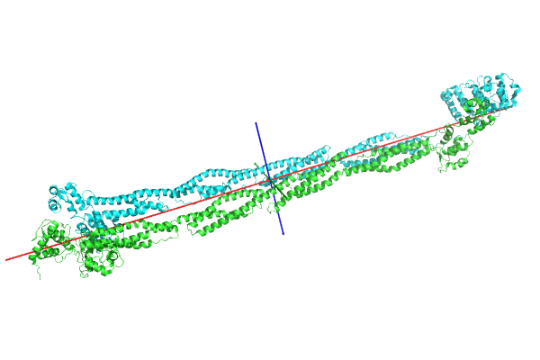
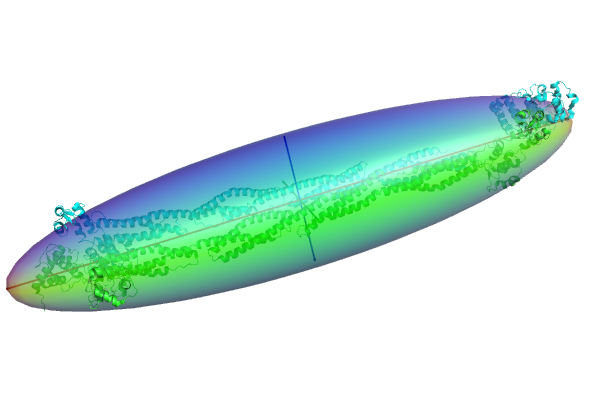

Principal axes
==============

This script adds pymol commands for calculating and viewing the principal moments of inertia of a structure.

The main command is `principalellipsoid`, provided by the file `principal_axes.py`. This draws the principal moments as three orthogonal axes.

The script is compatible with `ellipsoid.py`, which adds the ability to draw ellipsoids to PyMOL. The ellipsoid script should be loaded before principal_axes, and adds the `principalellipsoid` command to approximate the structure as an ellipsoid with radii given by the principal moments of inertia.

See `help principalellipsoid` for details about the supported options.


## Example

with the cryo-EM structure of chicken gizzard smooth muscle alpha-actinin ([1SJJ](http://www.rcsb.org/pdb/explore.do?structureId=1SJJ):


```
# ellipsoid is optional, but should be loaded first
run ellipsoid.py
run principal_axes.py
# load a structure
fetch 1SJJ
# display principal axes
principalaxes 1SJJ
```



```
# Display ellipsoid
principalellipsoid 1SJJ
```



## History

The first version of this script had been posted in the Biostar forum as an answer to [Question: Protein 3D structure principal axes](http://www.biostars.org/p/7393/)

This was adapted into a python script to generate .pml files by [@pierrepo](https://github.com/pierrepo/principal_axes).

The code was then modified to allow use directly from pymol by [@sbliven](https://github.com/sbliven/principal_axes)
